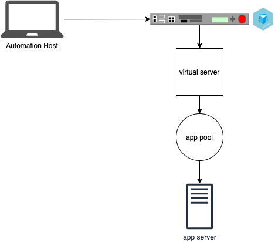
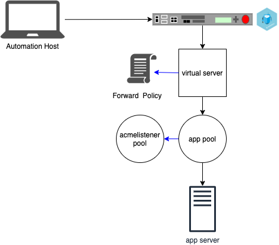
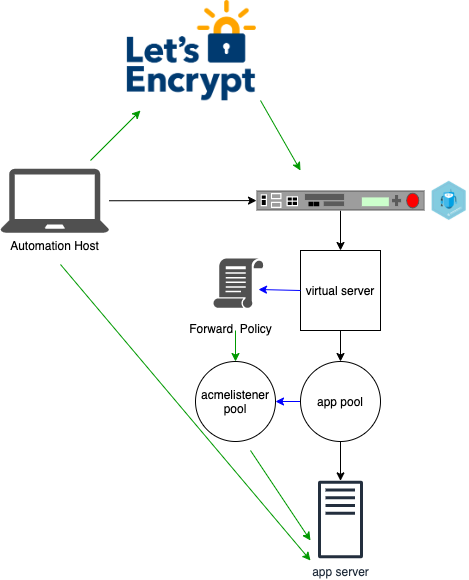
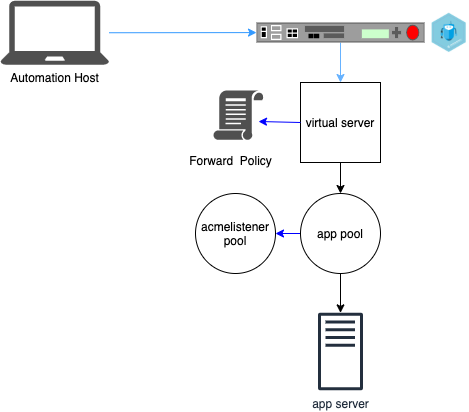

## Overview
This is an example of automating the request of new or updated certificates for BIG-IP virtual servers from Let's Encrypt, using the [ACME http_01 challenge protocol](https://letsencrypt.org/docs/challenge-types/#http-01-challenge). Once the processing infrastructure is in place, there are two Ansible playbooks in this example;
1. Request an updated/new certificate, prepare the challenge, retrieve the new certificates and keys
2. Update the BIG-IP virtual servers with the new certificates

## Pre-Conditions
- [Ansible](https://www.ansible.com/) 2.9+ installed on your automation host
- [F5 Ansible modules](https://galaxy.ansible.com/f5networks/f5_modules) installed with the above
- a web server running [NGINX](https://www.nginx.com/)
- F5 [BIG-IP](https://www.f5.com/products/big-ip-services) with the [Automation Toochain](https://www.f5.com/products/automation-and-orchestration) installed 
- Domain name with A Record/CNAME




Install this repository on your automation host. Verify that it is possible to ssh to BIG-IP from your automation host. On the BIG-IP create a virtual server for each application, with pools and application servers as appropriate.

### Create an inventory file
:warning: Since the inventory and its associated group and host vars will likely contain some sensitive information, prevent inadvertent leaks to public repositories by placing your *inventory.yml* somewhere outside of the repository directory. You can copy the *inventory.example.yml* as a starting point. 

For example, place the following in *inventory.yml*
```yaml
---
all:
  children:
    bigips:
      hosts:
        bigip1:
    webservers:
      hosts:
        webserver1:
    acmelisteners:
      hosts:
        acmelistener1:
```
Create *group_vars* and *host_vars* sub-directories within the directory where you placed your *inventory.yml* file.
Place the necessary address and access information in the appropriate *group_vars* or *host_vars*. Read [Using Variables](https://docs.ansible.com/ansible/latest/user_guide/playbooks_variables.html) in the Ansible documentation for more information. You can copy the *group_vars.example* and *host_vars.example* directories found in this repository as starting points. 

This demonstration code requires the groups *bigips* and *acmelisteners*. 


### Setup host variables for your BIG-IPs
For each of your BIG-IPs create a label in your *inventory.yml* as shown above for ```bigip1:```. In your *host_vars* directory, create a file for each BIG-IP named uniformly with the label in your *inventory.yml* file. For example, for the ```bigip1:``` reference in the inventory above, you would create a *bigip1.yml* file in your *host_vars* directory. In the host variables file put the following;
```yaml
---
ansible_host: 0.0.0.0
ansible_ssh_user: admin
ansible_ssh_pass: bigippassword
atc_provider:
  server: "{{ ansible_host }}"
  user: "{{ ansible_ssh_user }}"
  password: "{{ ansible_ssh_pass }}"
  server_port: 443
  validate_certs: false  
applications:
  A1:
    name: A1
    acme_staging_flag: "staging-" # staging-  set the flag to 'staging-' when using the staging API and an empty string ('') for the production API
    domain_name: "my.domain.name"
    organization_name: "my organization"
    country_name: "US"
    acme_email: "admin@emailaddress"
    acmechallenge_account_key: "myprivateaccountkey.key"
    template: https
    class: Service_HTTPS
    virtualAddress: "10.0.10.1"
    serverAddresses: "10.30.10.1,10.30.10.2"
```  
Update the values as appropriate for your BIG-IP. You can duplicate the *A1* block under ```applications:```. Each of those blocks will be used to create / update a virtual server on the BIG-IP. 

### Set the location for the keys and certs
Update the acme challenge variables in *group_vars/all.yml* to reference the location where your keys and certificates will be placed. 
:warning: This must not be within the repository directories in order to avoid inadvertently committing private keys to a public source control repository.
```yaml
acmechallenge_dir: "/path/to/acmechallengedirectory"
acmechallenge_keys_dir: "{{ acmechallenge_dir }}/keys"
acmechallenge_csrs_dir: "{{ acmechallenge_dir }}/csrs"
acmechallenge_certs_dir: "{{ acmechallenge_dir }}/certs"
privatekey_passphrase: "passphrase for keys"
acmechallenge_owner: "ownerofacmechallengedirectories"
acmechallenge_group: "groupofacmechallengedirectories"
```


### Create pool for dedicated ACME Challenge listener
Set the address of the NGINX web servers that will be used to handle acme requests in *host_vars/hostname.yml*. You can use */host_vars.example/acmelistener1.yml* as a starting point.
```yaml
www_root: /var/www
nginx_root: /etc/nginx
ansible_become: true
ansible_become_password: "sudopassword"
ansible_host: 0.0.0.0
ansible_user: admin
ansible_ssh_private_key_file: /path/to/privatekeyfile
```
and run the following command
```bash
ansible-playbook -i inventory.yml installacmelistener.yml
```


After the playbook completes successfully, in ```/Common/Shared``` a *pool* named ```acmelisteners``` and *policy* named ```forward_acme_challenge_requests``` are created. Add the policy to all virtual servers that host applications to will have certificates managed through these playbooks.
This will create a forward policy that directs .well-known/acme-challenge requests to acmelistener pool. 

### Request and retrieve a certificate from Lets Encrypt
```bash
ansible-playbook -i inventory.yml letsencrypt.yml
```


This will create a challenge to Let's Encrypt then it validates the challenge. Once succesfully validated the automation host will store the certificate and keys. 

### Put a file on the acme challenge listeners child
```bash
ansible-playbook -i inventory.yml placechallengefiles.yml
```


### Post certificates and keys to BIG-IPs
```bash
ansible-playbook -i inventory.yml postas3.yml
```



Lastly the automation host will post AS3 declaration to BIG-IP updating the virtual server with cerficate and key. 

